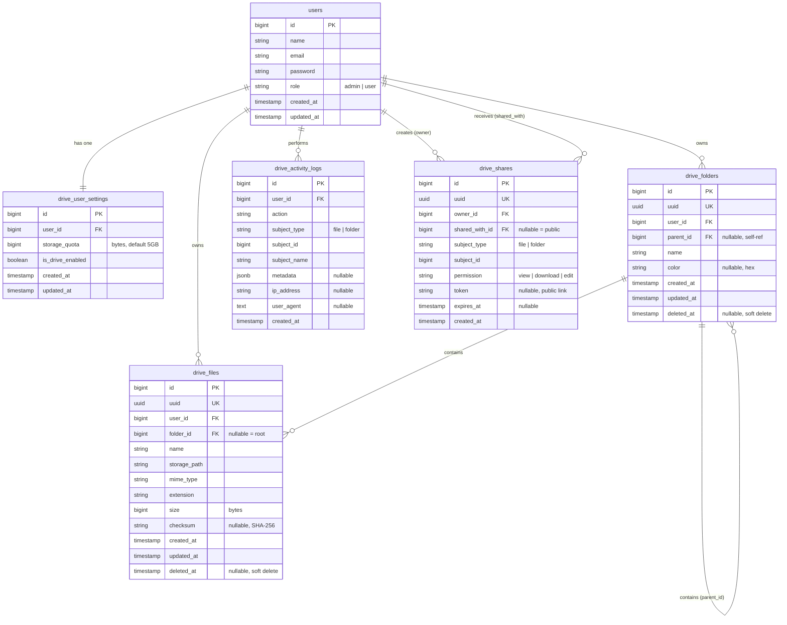

# 05 — Entity Relationship Diagram (ERD)

## ERD Lengkap (Mermaid)



---

## Penjelasan Relasi

| Relasi | Tipe | Keterangan |
|--------|------|------------|
| `users` → `drive_user_settings` | 1-to-1 | Setiap user punya 1 setting drive. Dibuat otomatis saat user pertama kali akses drive |
| `users` → `drive_folders` | 1-to-many | User bisa punya banyak folder |
| `users` → `drive_files` | 1-to-many | User bisa punya banyak file |
| `drive_folders` → `drive_folders` | Self-referencing 1-to-many | Folder bisa punya sub-folder (nested) |
| `drive_folders` → `drive_files` | 1-to-many | Folder bisa punya banyak file |
| `users` → `drive_activity_logs` | 1-to-many | Setiap aksi user dicatat |
| `users` → `drive_shares` (owner) | 1-to-many | User bisa share banyak file/folder *(Phase 3)* |
| `users` → `drive_shares` (shared_with) | 1-to-many | User bisa menerima banyak share *(Phase 3)* |

---

## Soft Delete Behavior

File dan folder yang dihapus **tidak langsung dihapus dari database** — melainkan kolom `deleted_at` diisi.

```
drive_files/drive_folders
├── deleted_at = NULL    → File aktif (tampil di My Drive)
└── deleted_at = <ts>   → File di Trash (tersembunyi dari Drive, tampil di Trash)
```

**Cascade Delete:**
- Jika `users` dihapus → semua `drive_files`, `drive_folders`, `drive_activity_logs` ikut terhapus (`ON DELETE CASCADE`)
- Jika `drive_folders` dihapus (hard delete) → `folder_id` di `drive_files` menjadi `NULL` (`ON DELETE SET NULL`)
- Jika folder parent soft-deleted → file/subfolder di dalamnya **juga** perlu di-soft-delete secara rekursif (handled di service layer)

---

## Path Hierarki Folder (Contoh)

```
users/{user_id}/
├── root (folder_id = NULL)
│   ├── Documents/           (drive_folders: id=1, parent_id=NULL)
│   │   ├── Report.pdf      (drive_files: folder_id=1)
│   │   └── Invoices/       (drive_folders: id=2, parent_id=1)
│   │       └── INV-001.pdf (drive_files: folder_id=2)
│   └── Photos/              (drive_folders: id=3, parent_id=NULL)
│       └── avatar.jpg      (drive_files: folder_id=3)
```
